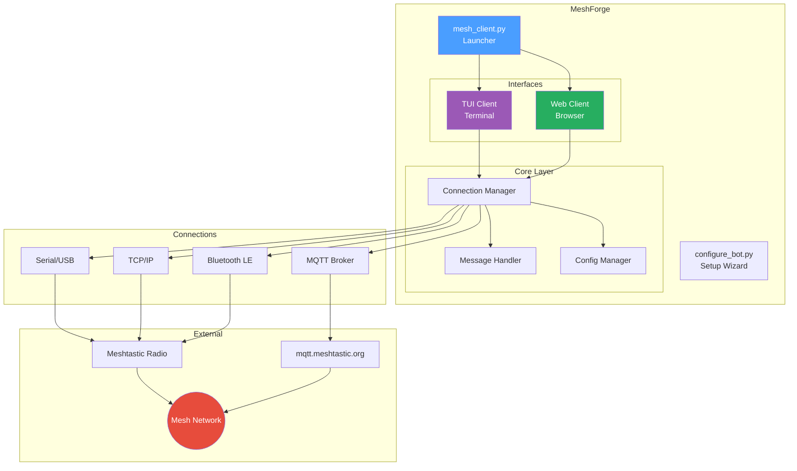
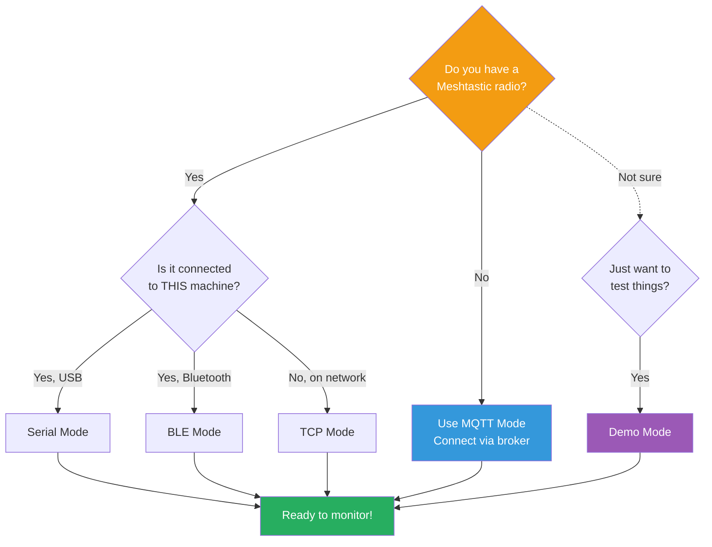
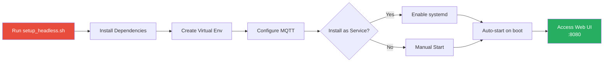
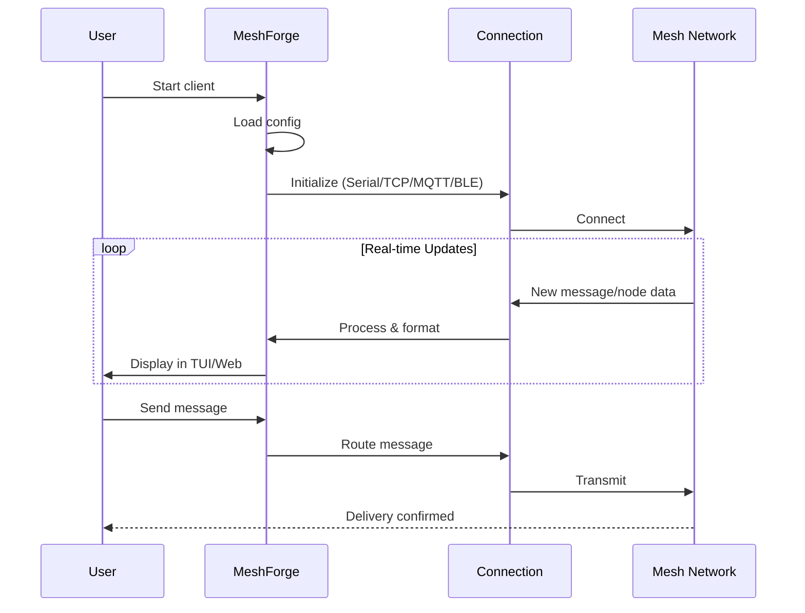
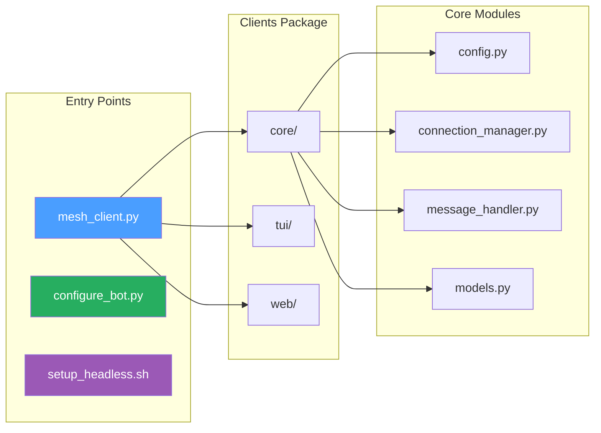

# MeshForge 🔧

Companion tools for [meshing-around](https://github.com/SpudGunMan/meshing-around) - configuration wizards, TUI/Web monitoring clients, and headless deployment scripts for your Meshtastic mesh network.

[](CHANGELOG.md)
[](LICENSE)
[](https://python.org)

> ⚠️ **Beta Software** - This is early-stage code. Test thoroughly before deploying!

## Architecture Overview



## TLDR

- **Configure meshing-around bot**: `python3 configure_bot.py`
- **Monitor your mesh (TUI)**: `python3 mesh_client.py --demo`
- **Web dashboard**: `python3 mesh_client.py --web --demo`
- **No radio? Use MQTT**: Works with mqtt.meshtastic.org

## What's This For?

Whether you're setting up a new meshing-around bot, want to monitor your mesh from SSH, or need a web dashboard for your Pi Zero 2W (no radio attached) - MeshForge has you covered.

**🔧 Configuration Tool** - Interactive setup wizard for meshing-around bot with 12 alert types, email/SMS notifications, and Pi auto-detection.

**📺 TUI Client** - Rich terminal interface that works great over SSH. See nodes, messages, alerts in real-time.

**🌐 Web Client** - Browser-based dashboard with WebSocket updates and REST API for automation.

**📡 MQTT Mode** - No radio required! Connect via mqtt.meshtastic.org and monitor the mesh from anywhere.

## Quick Start

```sh
# Clone it
git clone https://github.com/Nursedude/meshing_around_meshforge.git
cd meshing_around_meshforge

# Try demo mode first (no hardware needed)
python3 mesh_client.py --demo

# Or dive into setup
python3 mesh_client.py --setup
```

### Connection Options



| Mode | Need Radio? | Use Case |
|------|-------------|----------|
| Serial | Yes (USB) | Radio plugged into this machine |
| TCP | No | Radio on another machine (network) |
| MQTT | No | No radio at all - broker only |
| BLE | Yes | Bluetooth connection |
| Demo | No | Testing/development |

## Configuration

Everything lives in `mesh_client.ini`:

```ini
[connection]
type = mqtt                    # or serial, tcp, ble, auto
mqtt_broker = mqtt.meshtastic.org
mqtt_topic_root = msh/US

[features]
mode = tui                     # tui, web, both, headless
web_port = 8080
```

Run `python3 mesh_client.py --setup` for interactive configuration.

## Pi Zero 2W Setup (Headless, No Radio)

Perfect for a monitoring station using MQTT:



```sh
chmod +x setup_headless.sh
./setup_headless.sh
```

This sets up:
- Virtual environment (PEP 668 compliant)
- MQTT connection to public broker
- Optional systemd service for auto-start
- Web interface on port 8080

## Keyboard Shortcuts (TUI)

| Key | Action |
|-----|--------|
| `1-4` | Switch screens |
| `s` | Send message |
| `?` | Help |
| `q` | Quit |

## API Endpoints (Web)

| Endpoint | What it does |
|----------|--------------|
| `GET /api/status` | Connection info |
| `GET /api/nodes` | Node list |
| `GET /api/messages` | Message history |
| `POST /api/messages/send` | Send a message |

## How It Works



## Project Layout



```
├── mesh_client.py          # Start here - main launcher
├── mesh_client.ini         # Your configuration
├── configure_bot.py        # Bot setup wizard
├── setup_headless.sh       # Pi/headless installer
└── meshing_around_clients/ # TUI & Web apps
    ├── core/               # Shared code
    ├── tui/                # Terminal interface
    └── web/                # Web dashboard
```

## Requirements

- Python 3.8+
- Dependencies auto-install on first run (or use `--install-deps`)
- For serial: user in `dialout` group

## Contributing

PRs welcome! Please follow these principles:

- **No bare `except:`** - Use specific exception types
- **PEP 668** - Don't auto-install outside venv
- **Rich fallback** - UI should work without Rich library
- **INI config** - Keep everything configurable

## Credits

- [SpudGunMan](https://github.com/SpudGunMan) - meshing-around creator
- [Meshtastic](https://meshtastic.org) - The platform that makes this possible

## Links

- 📦 [meshing-around](https://github.com/SpudGunMan/meshing-around) - The bot this tools supports
- 📚 [Meshtastic Docs](https://meshtastic.org/docs/)
- 🐛 [Report Issues](https://github.com/Nursedude/meshing_around_meshforge/issues)

---

🥔 *Built with care for the Meshtastic community*
