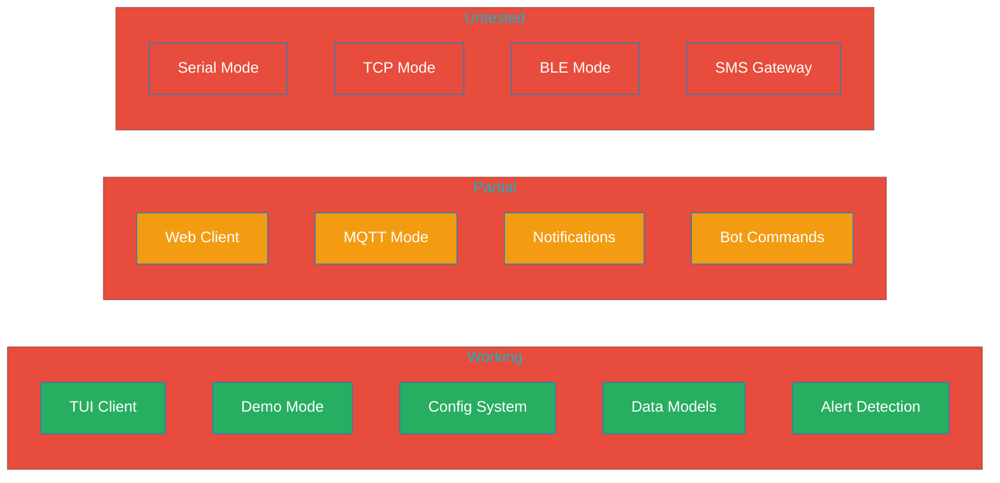
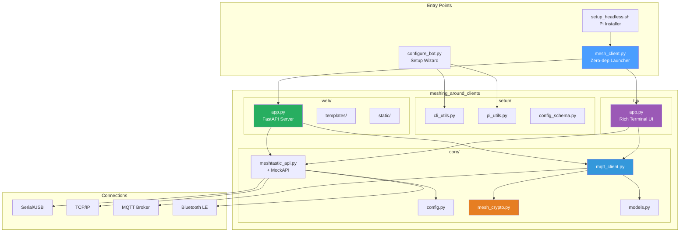
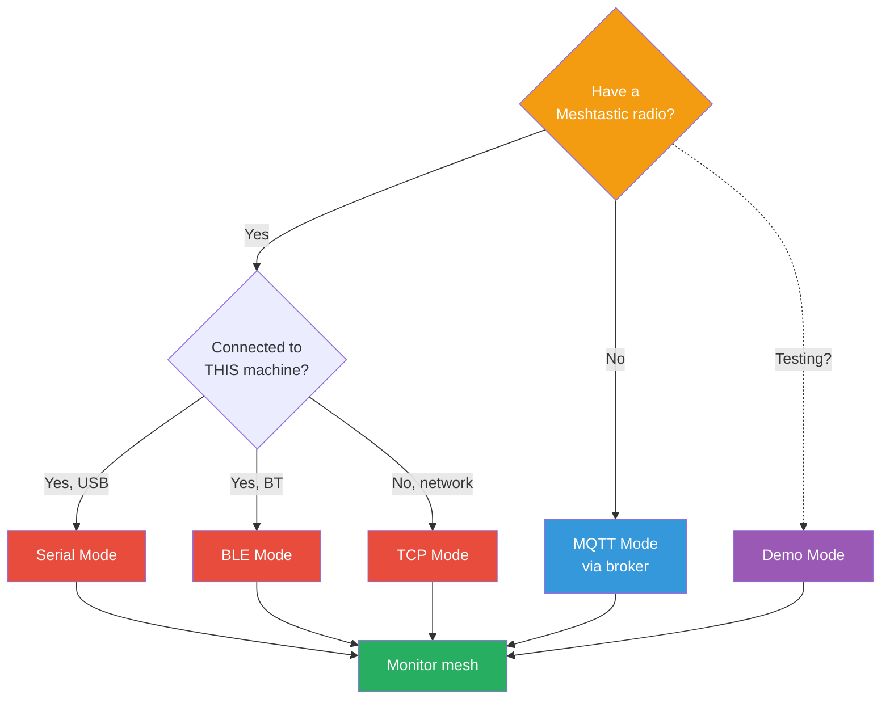
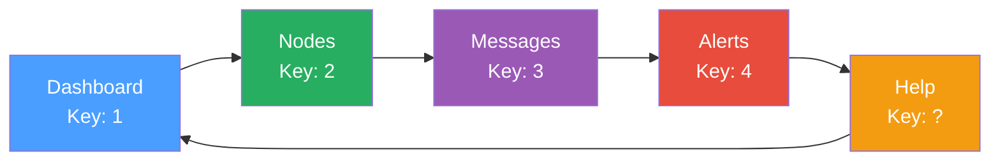

# MeshForge

Companion tools for [meshing-around](https://github.com/SpudGunMan/meshing-around) - configuration wizards, TUI/Web monitoring clients, and headless deployment scripts for your Meshtastic mesh network.

> Alert layer for the [MeshForge ecosystem](https://github.com/Nursedude/meshforge/blob/main/.claude/foundations/meshforge_ecosystem.md)

[](CHANGELOG.md)
[](LICENSE)
[](https://python.org)

> **EXTENSION MODULE** - This is a MeshForge extension module for [meshing-around](https://github.com/SpudGunMan/meshing-around). APIs and features are under active development and may change without notice. Not intended for production use.

> **BETA SOFTWARE** - Under active development. Some features are incomplete or untested. See [Feature Status](#feature-status) below.

> **NO RADIO REQUIRED** - MeshForge can connect to the Meshtastic mesh via MQTT broker without any radio hardware. Use Demo mode to explore the interface with simulated data, or MQTT mode to participate in live mesh channels using only a network connection.

## Supported Hardware

MeshForge works with any [Meshtastic-compatible device](https://meshtastic.org/docs/hardware/devices/). Tested and supported boards include:

| Device | Chipset | Connection Methods | Notes |
|--------|---------|-------------------|-------|
| **LILYGO T-Beam** | ESP32 + SX1276/SX1262 | Serial, TCP, BLE | GPS built-in, most common board |
| **LILYGO T-Lora** | ESP32 + SX1276/SX1262 | Serial, TCP, BLE | Compact, no GPS by default |
| **LILYGO T-Echo** | nRF52840 + SX1262 | Serial, BLE | E-ink display, GPS built-in |
| **LILYGO T-Deck** | ESP32-S3 + SX1262 | Serial, TCP, BLE | Keyboard + screen built-in |
| **Heltec LoRa 32** | ESP32 + SX1276/SX1262 | Serial, TCP, BLE | OLED display, affordable |
| **RAK WisBlock (RAK4631)** | nRF52840 + SX1262 | Serial, BLE | Modular, low power |
| **Station G2** | ESP32-S3 + SX1262 | Serial, TCP, BLE | High-power, long range |
| **No hardware** | N/A | **MQTT, Demo** | Connect via broker or simulate |

### Deployment Platforms

| Platform | Recommended Mode | Notes |
|----------|-----------------|-------|
| **Desktop/Laptop** | Any | Full TUI or Web interface |
| **Raspberry Pi 3/4/5** | Serial, MQTT | Full functionality |
| **Raspberry Pi Zero 2W** | MQTT | Use MQTT mode (limited USB bandwidth) |
| **Any Linux Server** | MQTT, TCP | Headless via systemd service |
| **Docker** | MQTT, TCP | No USB passthrough needed for MQTT |

## Feature Status



| Feature | Status | Notes |
|---------|--------|-------|
| **TUI Client** | Working | 6 screens, keyboard navigation |
| **Demo Mode** | Working | Simulated data for testing |
| **Config System** | Working | INI-based configuration |
| **Data Models** | Working | Node, Message, Alert, MeshNetwork |
| **Alert Detection** | Working | Emergency keywords, proximity |
| **Web Client** | Partial | API works, templates need testing |
| **MQTT Mode** | Partial | Connects but limited testing |
| **Notifications** | Partial | Email framework exists, untested |
| **Bot Commands** | Partial | Parser exists, handlers incomplete |
| **Serial Mode** | Untested | Requires hardware testing |
| **TCP Mode** | Untested | Requires network device |
| **BLE Mode** | Untested | Requires Bluetooth setup |
| **SMS Gateway** | Untested | Requires carrier configuration |

## Architecture



## Quick Start

```bash
# Clone
git clone https://github.com/Nursedude/meshing_around_meshforge.git
cd meshing_around_meshforge

# Install core dependencies (no radio hardware needed)
pip install rich paho-mqtt

# Try demo mode — explore the UI with simulated data
python3 mesh_client.py --demo

# MQTT mode — join the live mesh without a radio
python3 mesh_client.py --mqtt

# Interactive setup wizard — configure connection, alerts, notifications
python3 mesh_client.py --setup

# Connect to a USB radio (if you have one)
python3 mesh_client.py --serial

# Headless Raspberry Pi setup
./setup_headless.sh
```

## Connection Modes



| Mode | Radio Required | Status | Use Case |
|------|----------------|--------|----------|
| **Demo** | No | **Working** | Test the UI with simulated nodes and messages |
| **MQTT** | No | Partial | Join live mesh channels via broker — no radio needed |
| **Serial** | Yes (USB) | Untested | Direct USB connection to a Meshtastic device |
| **TCP** | No (network) | Untested | Connect to a remote device over WiFi/LAN (port 4403) |
| **BLE** | Yes (nearby) | Untested | Bluetooth Low Energy to a nearby device |
| **Auto** | Depends | Working | Tries Serial → TCP → MQTT → Demo in order |

### Running Without a Radio

You do **not** need a Meshtastic radio to use MeshForge. Two modes work without any hardware:

- **MQTT Mode** — Connects to the public Meshtastic MQTT broker (`mqtt.meshtastic.org`) or your own private broker. You can monitor mesh traffic, see nodes, read and send messages, and receive alerts — all over the internet.
- **Demo Mode** — Generates simulated nodes with realistic positions, telemetry, and messages. Use this to explore every screen and feature before connecting to a live mesh.

```bash
# MQTT mode — join the live mesh without a radio
python3 mesh_client.py --mqtt

# Demo mode — explore the interface with simulated data
python3 mesh_client.py --demo
```

## Configuration

All settings live in `mesh_client.ini` (or `config.enhanced.ini` for full alert configuration). Every feature is configurable — nothing is hardcoded.

**Config file search order:**
1. `~/.config/meshing-around-clients/config.ini` (recommended)
2. `./mesh_client.ini` (local)
3. `./client_config.ini` (alternative)
4. `/etc/meshing-around-clients/config.ini` (system-wide)

### Connection Settings

```ini
[interface]
type = mqtt                    # serial, tcp, ble, mqtt, auto, demo
port = /dev/ttyUSB0            # Serial port (auto-detect if empty)
hostname = 192.168.1.100       # TCP host address
mac = AA:BB:CC:DD:EE:FF        # BLE MAC address
baudrate = 115200              # Serial baud rate
```

### MQTT Settings

```ini
[mqtt]
broker = mqtt.meshtastic.org   # Broker hostname (or your own)
port = 1883                    # 1883 standard, 8883 for TLS
use_tls = false                # Enable TLS encryption
username = meshdev             # Broker credentials
password = large4cats          # Public broker default
topic_root = msh/US            # Region: US, EU_868, EU_433, AU_915, CN, JP, etc.
channel = LongFast             # Channel name (must match device config)
encryption_key =               # Base64 256-bit PSK for private channels
node_id = !meshforg            # Virtual node ID for MQTT-only operation
qos = 1                        # MQTT QoS level (0, 1, 2)
reconnect_delay = 5            # Seconds between reconnect attempts
max_reconnect_attempts = 10    # Give up after N failures
uplink_enabled = true          # Receive messages from mesh
downlink_enabled = true        # Send messages to mesh
```

### UI and Feature Settings

```ini
[features]
mode = tui                     # tui, web, or both
web_port = 8080                # Web UI port

[general]
bot_name = MeshBot             # Display name
favoriteNodeList =             # Comma-separated favorite node numbers
bbs_admin_list =               # Admin node numbers
```

### Alert Configuration

All 12 alert types are independently configurable. Each supports enable/disable, custom thresholds, notification routing, cooldown periods, and logging. See `config.enhanced.ini` for the full reference.

| Alert Type | Section | Key Settings |
|------------|---------|--------------|
| **Emergency** | `[emergencyHandler]` | Keywords, cooldown, sound, email, SMS |
| **Proximity** | `[proximityAlert]` | Target lat/lon, radius (meters), script trigger |
| **Altitude** | `[altitudeAlert]` | Min altitude threshold (meters) |
| **Weather** | `[weatherAlert]` | NOAA severity levels, location, check interval |
| **iPAWS/EAS** | `[ipawsAlert]` | State/county codes, FEMA alert types |
| **Volcano** | `[volcanoAlert]` | USGS volcano IDs, alert levels |
| **Battery** | `[batteryAlert]` | Threshold %, per-node monitoring |
| **Noisy Node** | `[noisyNodeAlert]` | Message threshold, auto-mute, whitelist |
| **New Node** | `[newNodeAlert]` | Welcome message, DM or channel announce |
| **SNR** | `[snrAlert]` | SNR threshold (dB), monitor mode |
| **Disconnect** | `[disconnectAlert]` | Offline timeout (minutes), node watchlist |
| **Custom** | `[customAlert]` | User-defined keywords, case sensitivity |

### Global Alert Settings

```ini
[alertGlobal]
global_enabled = True          # Master on/off for all alerts
quiet_hours =                  # Suppress alerts during HH:MM-HH:MM
max_alerts_per_hour = 20       # Rate limiting across all types
emergency_priority = 4         # Priority levels: 1=low to 4=critical
```

### Notification Settings

```ini
[smtp]
enableSMTP = False             # Email notifications
SMTP_SERVER = smtp.gmail.com   # SMTP server
SMTP_PORT = 587                # SMTP port
SMTP_USERNAME =                # Email credentials
SMTP_PASSWORD =
SMTP_FROM =                    # Sender address

[sms]
enabled = False                # SMS via email-to-SMS gateway
gateway =                      # e.g., @txt.att.net, @tmomail.net
phone_numbers =                # Comma-separated phone numbers
```

## TUI Screens



| Key | Action |
|-----|--------|
| `1-4` | Switch screens |
| `s` | Send message |
| `r` | Refresh |
| `c` | Connect/Disconnect |
| `?` | Help |
| `q` | Quit |

## Alert System

MeshForge includes 12 configurable alert types. Each can be independently enabled, routed to different notification channels, and tuned with custom thresholds.

| Alert Type | Trigger | Default Severity | Configurable |
|------------|---------|-----------------|--------------|
| **Emergency** | Keywords (911, SOS, HELP, mayday, etc.) | Critical | Keywords, cooldown, sound, email, SMS |
| **Proximity** | Node enters/exits geofence radius | Medium | Target coordinates, radius, script trigger |
| **Altitude** | Node exceeds altitude threshold | Medium | Altitude threshold (meters) |
| **Weather** | NOAA severe weather alerts | High | Severity levels, location, check interval |
| **iPAWS/EAS** | FEMA emergency alerts | High | State/county, alert categories |
| **Volcano** | USGS volcanic activity | High | Volcano IDs, alert levels |
| **Battery** | Node battery below threshold | Medium | Threshold %, per-node monitoring |
| **Noisy Node** | Excessive message rate | Low | Message count/period, auto-mute |
| **New Node** | First-seen node joins mesh | Low | Welcome message, DM or channel |
| **SNR** | Signal-to-noise ratio spike | Low | SNR threshold (dB) |
| **Disconnect** | Node goes offline | Medium | Timeout (minutes), node watchlist |
| **Custom** | User-defined keywords | Configurable | Keywords, response template, case sensitivity |

**Notification methods:** Channel message, Direct message, Email (SMTP), SMS (email-to-SMS gateway), Sound alerts, Script execution

## Command Line Options

```
python3 mesh_client.py [OPTIONS]

Options:
  --setup         Interactive configuration wizard
  --check         Check dependencies only
  --install-deps  Install dependencies and exit
  --tui           Force TUI mode
  --web           Force Web mode
  --demo          Demo mode (no hardware)
  --mqtt          Force MQTT mode
  --serial        Force Serial mode
  --no-venv       Don't use virtual environment
  --version       Show version
```

## API Endpoints (Web)

| Endpoint | Method | Description |
|----------|--------|-------------|
| `/api/status` | GET | Connection info |
| `/api/network` | GET | Full network state |
| `/api/nodes` | GET | Node list |
| `/api/nodes/{id}` | GET | Specific node details |
| `/api/messages` | GET | Message history |
| `/api/messages/send` | POST | Send message |
| `/api/alerts` | GET | All alerts |
| `/api/alerts/acknowledge` | POST | Acknowledge alert |
| `/api/connect` | POST | Connect to device |
| `/api/disconnect` | POST | Disconnect |
| `/ws` | WebSocket | Real-time updates |

### WebSocket

Real-time updates via WebSocket at `ws://host:port/ws`:

```javascript
const ws = new WebSocket('ws://localhost:8080/ws');

ws.onmessage = (event) => {
    const msg = JSON.parse(event.data);
    // msg.type: 'init', 'message', 'alert', 'node_update'
};

// Send message
ws.send(JSON.stringify({
    type: 'send_message',
    text: 'Hello mesh!',
    destination: '^all',
    channel: 0
}));
```

## Systemd Service

Auto-start on boot (installed by `setup_headless.sh`):

```bash
sudo systemctl enable mesh-client    # Enable auto-start
sudo systemctl start mesh-client     # Start
sudo systemctl stop mesh-client      # Stop
sudo systemctl status mesh-client    # Check status
sudo journalctl -u mesh-client -f    # View logs
```

## Project Structure

```
meshing_around_meshforge/
├── mesh_client.py          # Main launcher (zero-dep bootstrap)
├── mesh_client.ini         # Configuration
├── configure_bot.py        # Bot setup wizard
├── setup_headless.sh       # Pi/headless installer
└── meshing_around_clients/
    ├── core/               # Runtime modules
    │   ├── config.py       # Config management
    │   ├── meshtastic_api.py  # Device API + MockAPI
    │   ├── mqtt_client.py  # MQTT broker connection
    │   ├── mesh_crypto.py  # AES-256-CTR (optional deps)
    │   └── models.py       # Node, Message, Alert, MeshNetwork
    ├── setup/              # Setup-only (configure_bot.py)
    │   ├── cli_utils.py    # Terminal colors, input helpers
    │   ├── pi_utils.py     # Pi detection, serial ports
    │   ├── system_maintenance.py
    │   ├── alert_configurators.py
    │   └── config_schema.py
    ├── tui/
    │   └── app.py          # Rich terminal UI
    └── web/
        ├── app.py          # FastAPI server
        ├── templates/
        └── static/
```

## Known Issues

- **Serial/TCP/BLE modes**: Not yet tested with real hardware — see [HARDWARE_TESTING.md](HARDWARE_TESTING.md) to contribute test results
- **Web templates**: May have rendering issues
- **MQTT reconnection**: Auto-reconnect with exponential backoff (up to 300s), but limited real-world testing
- **Notifications**: Email/SMS framework exists but untested with live credentials
- **Multi-interface**: Single connection at a time (upstream meshing-around supports up to 9)

## Dependencies

**Core (no radio needed):**
- `rich` - TUI interface (with plain-text fallback)
- `paho-mqtt` - MQTT client (for radio-less mesh access)

**Web UI (optional):**
- `fastapi` - Web framework
- `uvicorn` - ASGI server
- `jinja2` - Templates
- `python-multipart` - Form handling

**Radio hardware (optional — only for Serial/TCP/BLE):**
- `meshtastic` - Device API
- `pypubsub` - Event system

## Contributing

Issues and PRs welcome. Please:
- Use specific exception types (no bare `except:`)
- Maintain PEP 668 compliance
- Provide Rich library fallbacks
- Test with `--demo` before hardware

## Upstream Compatibility

MeshForge is designed to work with [meshing-around](https://github.com/SpudGunMan/meshing-around) (v1.9.9.x). Key differences:

| Feature | meshing-around | MeshForge |
|---------|---------------|-----------|
| Purpose | Bot server | Monitoring client |
| Interfaces | Up to 9 | Single |
| Config | `config.ini` | `mesh_client.ini` |
| Focus | Commands/games | Visualization |

## Links

- [meshing-around](https://github.com/SpudGunMan/meshing-around) - Parent project
- [Meshtastic](https://meshtastic.org) - Platform
- [Issues](https://github.com/Nursedude/meshing_around_meshforge/issues)

---

*Built for the Meshtastic community*
