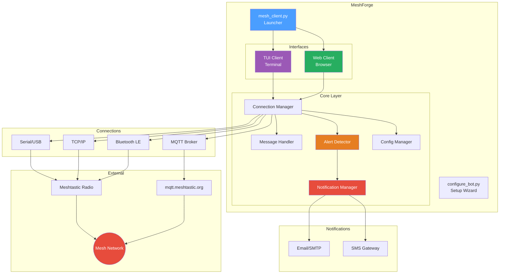
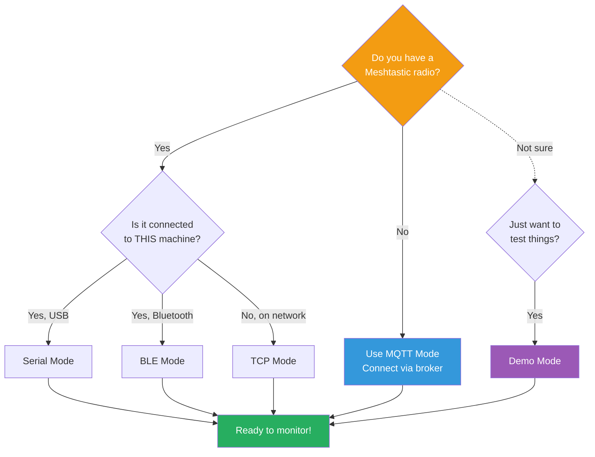
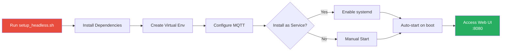
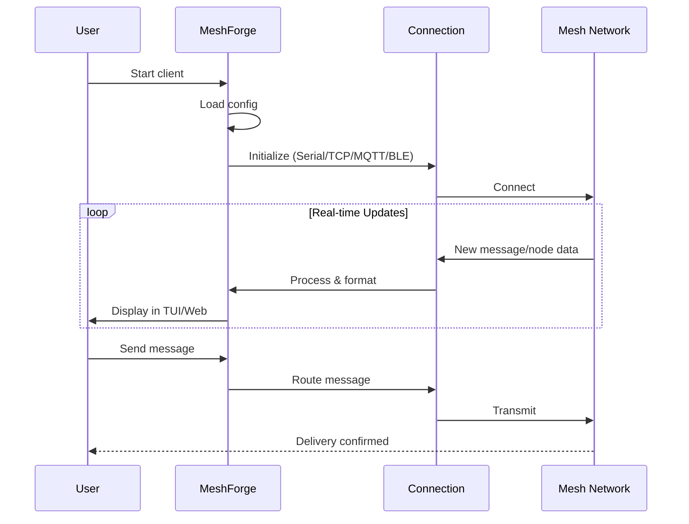
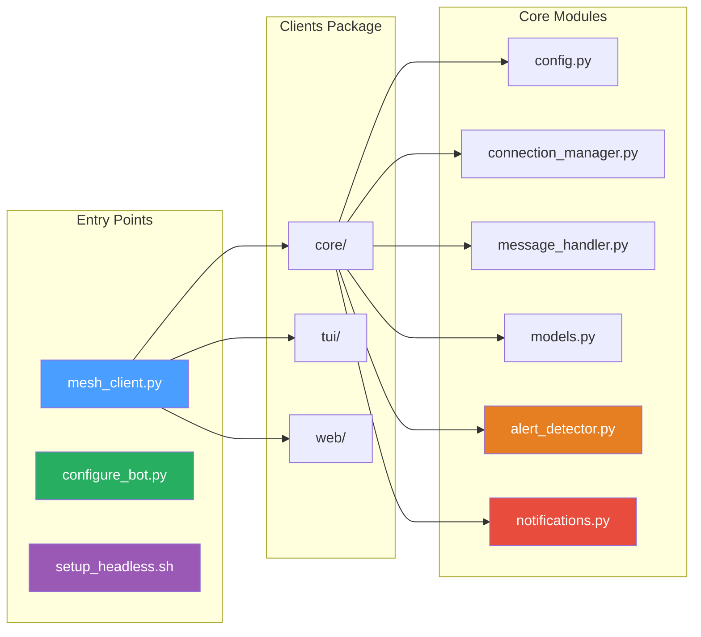

# MeshForge 🔧

Companion tools for [meshing-around](https://github.com/SpudGunMan/meshing-around) - configuration wizards, TUI/Web monitoring clients, and headless deployment scripts for your Meshtastic mesh network.

[](CHANGELOG.md)
[](LICENSE)
[](https://python.org)

> ⚠️ **UNSTABLE BETA** - This software is under active development and may contain bugs, incomplete features, or breaking changes. **Not recommended for production use.** Test thoroughly in isolated environments before any deployment. Features may change without notice between versions.

## Architecture Overview



## TLDR

- **Configure meshing-around bot**: `python3 configure_bot.py`
- **Monitor your mesh (TUI)**: `python3 mesh_client.py --demo`
- **Web dashboard**: `python3 mesh_client.py --web --demo`
- **No radio? Use MQTT**: Works with mqtt.meshtastic.org

## What's This For?

Whether you're setting up a new meshing-around bot, want to monitor your mesh from SSH, or need a web dashboard for your Pi Zero 2W (no radio attached) - MeshForge has you covered.

**🔧 Configuration Tool** - Interactive setup wizard for meshing-around bot with 12 alert types, email/SMS notifications, and Pi auto-detection.

**📺 TUI Client** - Rich terminal interface that works great over SSH. See nodes, messages, alerts in real-time.

**🌐 Web Client** - Browser-based dashboard with WebSocket updates and REST API for automation.

**📡 MQTT Mode** - No radio required! Connect via mqtt.meshtastic.org and monitor the mesh from anywhere.

## Quick Start

```sh
# Clone it
git clone https://github.com/Nursedude/meshing_around_meshforge.git
cd meshing_around_meshforge

# Try demo mode first (no hardware needed)
python3 mesh_client.py --demo

# Or dive into setup
python3 mesh_client.py --setup
```

### Connection Options



| Mode | Need Radio? | Use Case |
|------|-------------|----------|
| Serial | Yes (USB) | Radio plugged into this machine |
| TCP | No | Radio on another machine (network) |
| MQTT | No | No radio at all - broker only |
| BLE | Yes | Bluetooth connection |
| Demo | No | Testing/development |

## Configuration

Everything lives in `mesh_client.ini`:

```ini
[connection]
type = mqtt                    # or serial, tcp, ble, auto
mqtt_broker = mqtt.meshtastic.org
mqtt_topic_root = msh/US

[features]
mode = tui                     # tui, web, both, headless
web_port = 8080
```

Run `python3 mesh_client.py --setup` for interactive configuration.

## Pi Zero 2W Setup (Headless, No Radio)

Perfect for a monitoring station using MQTT:



```sh
chmod +x setup_headless.sh
./setup_headless.sh
```

This sets up:
- Virtual environment (PEP 668 compliant)
- MQTT connection to public broker
- Optional systemd service for auto-start
- Web interface on port 8080

## Keyboard Shortcuts (TUI)

| Key | Action |
|-----|--------|
| `1-4` | Switch screens |
| `s` | Send message |
| `?` | Help |
| `q` | Quit |

## API Endpoints (Web)

| Endpoint | What it does |
|----------|--------------|
| `GET /api/status` | Connection info |
| `GET /api/nodes` | Node list |
| `GET /api/messages` | Message history |
| `POST /api/messages/send` | Send a message |

## Bot Commands

MeshForge includes a full command handler system for mesh bot interaction:

| Command | Description |
|---------|-------------|
| `!ping` | Check bot connectivity (responds with pong) |
| `!help` | List all available commands |
| `!info` | Show bot/node information |
| `!stats` | Display mesh statistics |
| `!location [node]` | Get position info for a node |
| `!weather <loc>` | Get weather (requires API config) |
| `!bbs` | Bulletin board system - post/read messages |
| `!mail` | Private messaging between nodes |
| `!game <name>` | Play games (dopewars, blackjack, quiz, lemonade) |
| `!admin` | Admin commands (restricted to admin nodes) |

### BBS Subcommands
```
!bbs list          - List recent messages
!bbs read <id>     - Read a specific message
!bbs post <msg>    - Post a new message
!bbs delete <id>   - Delete message (admin only)
```

### Mail Subcommands
```
!mail check              - Check for new mail
!mail send <node> <msg>  - Send private message
!mail read <id>          - Read a message
```

## Alert System

MeshForge monitors your mesh and generates alerts:

| Alert Type | Trigger | Severity |
|------------|---------|----------|
| **Emergency** | Keywords detected (911, SOS, HELP, MAYDAY) | Critical (4) |
| **Disconnect** | Node not seen for configurable timeout | Medium (2) |
| **Noisy Node** | Node exceeds message rate threshold | Medium (2) |
| **Proximity** | Node enters/exits geofenced zone | Medium (2) |
| **Battery** | Node battery below 20% | Medium (2) |
| **New Node** | New node joins the mesh | Low (1) |
| **SNR** | Signal quality drops below threshold | Low (1) |

### Proximity Alerts (Geofencing)

Uses haversine distance calculation for accurate geofencing:

```python
# Example: Alert when node enters 1km radius of home base
zone = ProximityZone(
    name="Home Base",
    latitude=40.7128,
    longitude=-74.0060,
    radius_meters=1000,
    alert_on_enter=True,
    alert_on_exit=True
)
```

## Notifications

Get alerted via email or SMS when important events occur:

### Email (SMTP)
```ini
[email_notifications]
enabled = true
smtp_server = smtp.gmail.com
smtp_port = 587
username = your@email.com
from_address = your@email.com
to_addresses = alert@email.com, backup@email.com
```

### SMS Gateways

| Gateway Type | Description |
|--------------|-------------|
| `email` | Email-to-SMS (AT&T, Verizon, T-Mobile, etc.) |
| `http` | Generic HTTP API gateway |
| `twilio` | Twilio API |

```ini
[sms_notifications]
enabled = true
gateway_type = email
carrier_gateway = txt.att.net
phone_numbers = 5551234567, 5559876543
```

**Carrier Gateways:**
- AT&T: `txt.att.net`
- Verizon: `vtext.com`
- T-Mobile: `tmomail.net`
- Sprint: `messaging.sprintpcs.com`

### Notification Features
- **Rate limiting** - Prevent notification spam
- **Quiet hours** - No notifications during sleep (e.g., 22:00-07:00)
- **Severity filtering** - Only notify for important alerts

## How It Works



## Project Layout



```
├── mesh_client.py          # Start here - main launcher
├── mesh_client.ini         # Your configuration
├── configure_bot.py        # Bot setup wizard
├── setup_headless.sh       # Pi/headless installer
└── meshing_around_clients/ # TUI & Web apps
    ├── core/               # Shared code
    │   ├── config.py           # Configuration management
    │   ├── connection_manager.py # Multi-mode connections
    │   ├── message_handler.py  # Bot commands & processing
    │   ├── alert_detector.py   # Alert detection system
    │   ├── notifications.py    # Email/SMS notifications
    │   └── models.py           # Data models
    ├── tui/                # Terminal interface
    └── web/                # Web dashboard
```

## Requirements

- Python 3.8+
- Dependencies auto-install on first run (or use `--install-deps`)
- For serial: user in `dialout` group

## Security

MeshForge has undergone security hardening with 32+ issues fixed:

- **Network Security** - Web server binds to localhost by default, WebSocket authentication
- **Thread Safety** - Proper locking in logging, message handling, and connections
- **Input Validation** - Hardened config parsing and message handling
- **Secure Defaults** - No predictable temp files, specific exception handling

See [CHANGELOG.md](CHANGELOG.md) for full details.

## Contributing

PRs welcome! Please follow these principles:

- **No bare `except:`** - Use specific exception types
- **PEP 668** - Don't auto-install outside venv
- **Rich fallback** - UI should work without Rich library
- **INI config** - Keep everything configurable
- **Security first** - Bind to localhost, validate input, use secure temp files

## Credits

- [SpudGunMan](https://github.com/SpudGunMan) - meshing-around creator
- [Meshtastic](https://meshtastic.org) - The platform that makes this possible

## Links

- 📦 [meshing-around](https://github.com/SpudGunMan/meshing-around) - The bot this tools supports
- 📚 [Meshtastic Docs](https://meshtastic.org/docs/)
- 🐛 [Report Issues](https://github.com/Nursedude/meshing_around_meshforge/issues)

---

🥔 *Built with care for the Meshtastic community*
