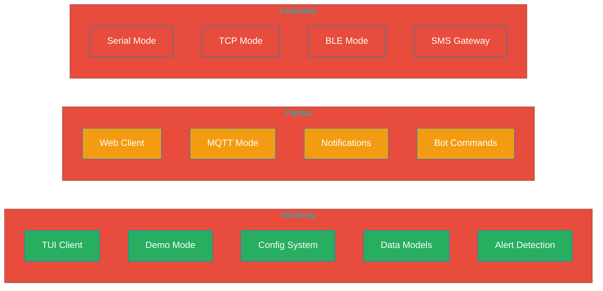
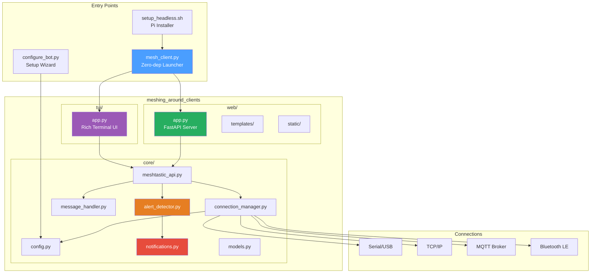
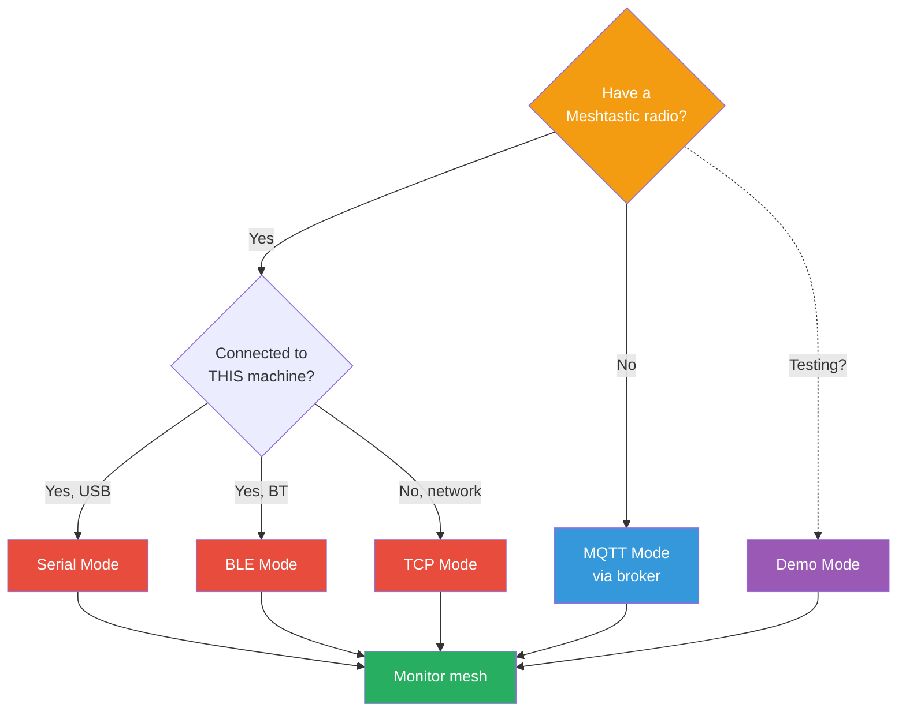
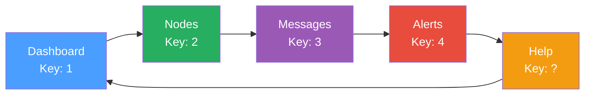

# MeshForge

Companion tools for [meshing-around](https://github.com/SpudGunMan/meshing-around) - configuration wizards, TUI/Web monitoring clients, and headless deployment scripts for your Meshtastic mesh network.

[](CHANGELOG.md)
[](LICENSE)
[](https://python.org)

> **EXTENSION MODULE** - This is a MeshForge extension module for [meshing-around](https://github.com/SpudGunMan/meshing-around). APIs and features are under active development and may change without notice. Not intended for production use.

> **BETA SOFTWARE** - Under active development. Some features are incomplete or untested. See [Feature Status](#feature-status) below.

## Feature Status



| Feature | Status | Notes |
|---------|--------|-------|
| **TUI Client** | Working | 6 screens, keyboard navigation |
| **Demo Mode** | Working | Simulated data for testing |
| **Config System** | Working | INI-based configuration |
| **Data Models** | Working | Node, Message, Alert, MeshNetwork |
| **Alert Detection** | Working | Emergency keywords, proximity |
| **Web Client** | Partial | API works, templates need testing |
| **MQTT Mode** | Partial | Connects but limited testing |
| **Notifications** | Partial | Email framework exists, untested |
| **Bot Commands** | Partial | Parser exists, handlers incomplete |
| **Serial Mode** | Untested | Requires hardware testing |
| **TCP Mode** | Untested | Requires network device |
| **BLE Mode** | Untested | Requires Bluetooth setup |
| **SMS Gateway** | Untested | Requires carrier configuration |

## Architecture



## Quick Start

```bash
# Clone
git clone https://github.com/Nursedude/meshing_around_meshforge.git
cd meshing_around_meshforge

# Install dependencies
pip install rich paho-mqtt

# Try demo mode (no hardware needed)
python3 mesh_client.py --demo

# Interactive setup
python3 mesh_client.py --setup
```

## Connection Modes



| Mode | Radio Required | Status |
|------|----------------|--------|
| Demo | No | **Working** |
| MQTT | No | Partial |
| Serial | Yes (USB) | Untested |
| TCP | No | Untested |
| BLE | Yes | Untested |

## Configuration

All settings in `mesh_client.ini`:

```ini
[connection]
type = mqtt                    # demo, mqtt, serial, tcp, ble
mqtt_broker = mqtt.meshtastic.org
mqtt_topic_root = msh/US

[features]
mode = tui                     # tui, web, both
web_port = 8080
```

## TUI Screens



| Key | Action |
|-----|--------|
| `1-4` | Switch screens |
| `s` | Send message |
| `r` | Refresh |
| `?` | Help |
| `q` | Quit |

## Alert System

| Alert Type | Trigger | Severity |
|------------|---------|----------|
| Emergency | Keywords (911, SOS, HELP) | Critical |
| Disconnect | Node timeout | Medium |
| New Node | First seen | Low |
| Battery | Below 20% | Medium |
| Proximity | Geofence enter/exit | Medium |

## API Endpoints (Web)

| Endpoint | Method | Description |
|----------|--------|-------------|
| `/api/status` | GET | Connection info |
| `/api/nodes` | GET | Node list |
| `/api/messages` | GET | Message history |
| `/api/messages/send` | POST | Send message |
| `/ws` | WebSocket | Real-time updates |

## Project Structure

```
meshing_around_meshforge/
├── mesh_client.py          # Main launcher (zero-dep bootstrap)
├── mesh_client.ini         # Configuration
├── configure_bot.py        # Bot setup wizard
├── setup_headless.sh       # Pi/headless installer
└── meshing_around_clients/
    ├── core/               # Shared modules
    │   ├── config.py       # Config management
    │   ├── connection_manager.py
    │   ├── meshtastic_api.py
    │   ├── message_handler.py
    │   ├── alert_detector.py
    │   ├── notifications.py
    │   └── models.py       # Node, Message, Alert
    ├── tui/
    │   └── app.py          # Rich terminal UI
    └── web/
        ├── app.py          # FastAPI server
        ├── templates/
        └── static/
```

## Known Issues

- **Serial/TCP/BLE modes**: Not tested with real hardware
- **Web templates**: May have rendering issues
- **MQTT reconnection**: Limited retry logic
- **Notifications**: Email/SMS sending untested
- **Multi-interface**: Only single connection supported (upstream supports 9)

## Dependencies

**Core:**
- `rich` - TUI interface
- `paho-mqtt` - MQTT client

**Web (optional):**
- `fastapi` - Web framework
- `uvicorn` - ASGI server
- `jinja2` - Templates

**Hardware (optional):**
- `meshtastic` - Device API

## Contributing

Issues and PRs welcome. Please:
- Use specific exception types (no bare `except:`)
- Maintain PEP 668 compliance
- Provide Rich library fallbacks
- Test with `--demo` before hardware

## Upstream Compatibility

MeshForge is designed to work with [meshing-around](https://github.com/SpudGunMan/meshing-around) (v1.9.9.x). Key differences:

| Feature | meshing-around | MeshForge |
|---------|---------------|-----------|
| Purpose | Bot server | Monitoring client |
| Interfaces | Up to 9 | Single |
| Config | `config.ini` | `mesh_client.ini` |
| Focus | Commands/games | Visualization |

## Links

- [meshing-around](https://github.com/SpudGunMan/meshing-around) - Parent project
- [Meshtastic](https://meshtastic.org) - Platform
- [Issues](https://github.com/Nursedude/meshing_around_meshforge/issues)

---

*Built for the Meshtastic community*
