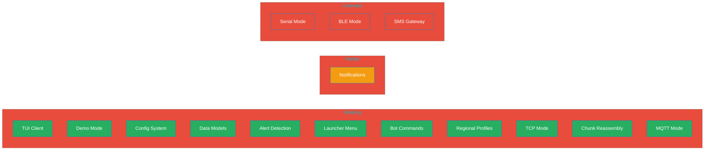
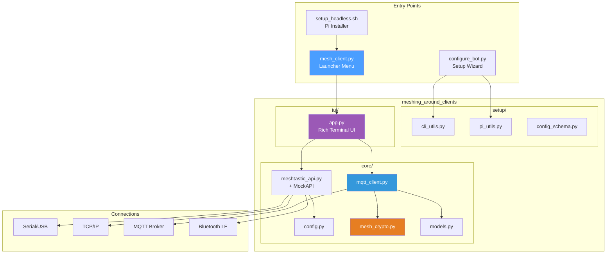
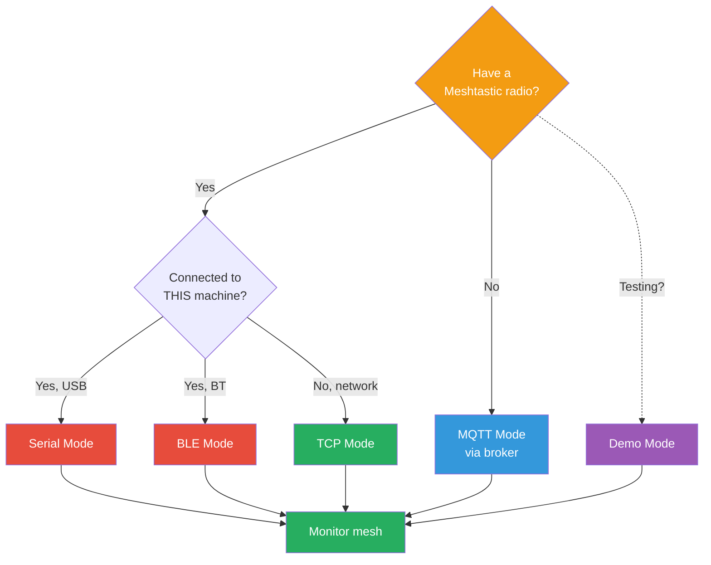

# meshing_around_meshforge

Full companion client for [meshing-around](https://github.com/SpudGunMan/meshing-around) — TUI monitoring dashboard, 51 mesh commands, config editor, and headless deployment for Meshtastic mesh networks.

> Alert layer for the [meshforge ecosystem](https://github.com/Nursedude/meshforge/blob/main/.claude/foundations/meshforge_ecosystem.md) - note: this is `meshing_around_meshforge`, a separate project from [Nursedude/meshforge](https://github.com/Nursedude/meshforge)

[](CHANGELOG.md)
[](LICENSE)
[](https://python.org)
[](tests/)
[](https://nursedude.substack.com)

> **Part of the MeshForge ecosystem** — works alongside [meshforge](https://github.com/Nursedude/meshforge) (NOC) and [meshforge-maps](https://github.com/Nursedude/meshforge-maps) (visualization). MeshForge NOC imports alert types, crypto, and MockAPI from this repo via `safe_import`.

> **EXTENSION MODULE** - This is a meshing_around_meshforge extension module for [meshing-around](https://github.com/SpudGunMan/meshing-around). APIs and features are under active development and may change without notice. Not intended for production use.

> **BETA SOFTWARE** - Under active development. Some features are incomplete or untested. See [Feature Status](#feature-status) below.

> **NEEDS TESTING** - The TUI, Demo mode, and core models are well-tested (790 automated tests). Serial, TCP, BLE, and SMS modes have **zero real-world testing** and need community validation with actual hardware. MQTT has limited testing against live brokers. If you can help test, see [HARDWARE_TESTING.md](HARDWARE_TESTING.md).

> **NO RADIO REQUIRED** - meshing_around_meshforge can connect to the Meshtastic mesh via MQTT broker without any radio hardware. Use Demo mode to explore the interface with simulated data, or MQTT mode to participate in live mesh channels using only a network connection.

## Supported Hardware

meshing_around_meshforge works with any [Meshtastic-compatible device](https://meshtastic.org/docs/hardware/devices/). Tested and supported boards include:

| Device | Chipset | Connection Methods | Notes |
|--------|---------|-------------------|-------|
| **LILYGO T-Beam** | ESP32 + SX1276/SX1262 | Serial, TCP, BLE | GPS built-in, most common board |
| **LILYGO T-Lora** | ESP32 + SX1276/SX1262 | Serial, TCP, BLE | Compact, no GPS by default |
| **LILYGO T-Echo** | nRF52840 + SX1262 | Serial, BLE | E-ink display, GPS built-in |
| **LILYGO T-Deck** | ESP32-S3 + SX1262 | Serial, TCP, BLE | Keyboard + screen built-in |
| **Heltec LoRa 32** | ESP32 + SX1276/SX1262 | Serial, TCP, BLE | OLED display, affordable |
| **RAK WisBlock (RAK4631)** | nRF52840 + SX1262 | Serial, BLE | Modular, low power |
| **Station G2** | ESP32-S3 + SX1262 | Serial, TCP, BLE | High-power, long range |
| **No hardware** | N/A | **MQTT, Demo** | Connect via broker or simulate |

### Deployment Platforms

| Platform | Recommended Mode | Notes |
|----------|-----------------|-------|
| **Desktop/Laptop** | Any | Full TUI interface |
| **Raspberry Pi 3/4/5** | Serial, MQTT | Full functionality |
| **Raspberry Pi Zero 2W** | MQTT | See [Pi Zero 2W Guide](#raspberry-pi-zero-2w) below |
| **Any Linux Server** | MQTT, TCP | Headless via systemd service |
| **Docker** | MQTT, TCP | No USB passthrough needed for MQTT |

### Raspberry Pi Zero 2W

The Pi2W's single micro USB port is power-only, making direct radio connections impractical. **Three deployment options** are supported, all using MQTT. All three are end-to-end validated on real hardware.

#### Option 1: MQTT Monitor (no radio) — receive-only

Connect directly to the public Meshtastic MQTT broker. Monitor mesh traffic, track nodes, log alerts. Zero hardware beyond the Pi itself.

```ini
[interface]
type = mqtt

[mqtt]
enabled = true
broker = mqtt.meshtastic.org
username = meshdev
password = large4cats

[commands]
auto_respond = false    # MANDATORY on public brokers
```

#### Option 2: Mosquitto Bridge (local broker caching)

Run a local Mosquitto broker that bridges to the public broker. Local caching, survives internet blips, and other LAN devices can subscribe. Ready-to-use templates are included:

```bash
sudo apt install mosquitto mosquitto-clients
sudo cp templates/mosquitto-listener.conf /etc/mosquitto/conf.d/
sudo cp templates/mosquitto-bridge-public.conf /etc/mosquitto/conf.d/
sudo systemctl restart mosquitto
```

The bridge is **receive-only** (`topic msh/US/# in 1`) — the Pi will never publish to the public broker. Then point mesh_client at localhost:

```ini
[interface]
type = mqtt

[mqtt]
enabled = true
broker = localhost
```

#### Option 3: WiFi Radio — full bidirectional, end-to-end validated

Pair the Pi2W with a standalone WiFi-capable Meshtastic device (Station G2, Heltec V3, T-Beam, RAK). The radio runs on battery/solar, the Pi on PoE — no physical connection between them:

```
[Battery/Solar]                 [PoE]
  Meshtastic Radio  --WiFi-->  Pi2W
  (native MQTT uplink)          Mosquitto:1883
        ^                         │
        │                         ├── mesh_client (TUI, MQTT)
        │                         └── meshing-around bot (TCP :4403 -> radio)
        │
        └── MQTT downlink (mesh_client sends commands)
```

**Bidirectional proof:** commands typed in the Pi's TUI are published as encrypted `ServiceEnvelope` protobufs to `msh/{root}/2/e/{channel}/{node_id}`. The radio subscribes to that topic, decrypts with the channel PSK, and retransmits over LoRa. Bot responses go the other way via the TCP-connected meshing-around bot.

**The launcher menu's "Configure WiFi Radio Link" wizard** auto-detects the Pi's routable IP, connects via `meshtastic.tcp_interface.TCPInterface` to the device's protobuf API, writes the correct native MQTT config (broker, channel, encryption), reads the channel PSK from the device, and generates a safe virtual `node_id` (`!c0de...` prefix) for `mesh_client.ini` so mesh_client's publishes aren't filtered as loopback by the firmware.

**Power considerations:**
- Pi2W on PoE (stable, always-on)
- Radio on battery + solar panel (field-deployable, independent)
- Micro USB is power-only — no USB OTG hub needed

**Single-TCP-client caveat:** Meshtastic firmware's TCP protobuf API only accepts one active client at a time. If you also run `rnsd` or another service that opens a Meshtastic interface, it may fight the display client for the slot. See [Known Issues](#known-issues) for the rnsd auto-loading plugin gotcha.

## Feature Status


```mermaid
%%{init: {'theme': 'base', 'themeVariables': { 'primaryColor': '#4a9eff', 'primaryTextColor': '#fff', 'primaryBorderColor': '#2980b9', 'lineColor': '#666', 'secondaryColor': '#27ae60', 'tertiaryColor': '#e74c3c'}}}%%
graph LR
    subgraph "Working"
        TUI[TUI Client]
        DEMO[Demo Mode]
        CFG[Config System]
        MODELS[Data Models]
        ALERTS[Alert Detection]
        LAUNCH[Launcher Menu]
        CMDS[Bot Commands]
        PROF[Regional Profiles]
        TCP[TCP Mode]
        CHUNK[Chunk Reassembly]
        MQTT[MQTT Mode]
    end

    subgraph "Partial"
        NOTIFY[Notifications]
    end

    subgraph "Untested"
        SERIAL[Serial Mode]
        BLE[BLE Mode]
        SMS[SMS Gateway]
    end

    style TUI fill:#27ae60,color:#fff
    style DEMO fill:#27ae60,color:#fff
    style CFG fill:#27ae60,color:#fff
    style MODELS fill:#27ae60,color:#fff
    style ALERTS fill:#27ae60,color:#fff
    style LAUNCH fill:#27ae60,color:#fff
    style MQTT fill:#27ae60,color:#fff
    style NOTIFY fill:#f39c12,color:#fff
    style CMDS fill:#27ae60,color:#fff
    style PROF fill:#27ae60,color:#fff
    style SERIAL fill:#e74c3c,color:#fff
    style TCP fill:#27ae60,color:#fff
    style CHUNK fill:#27ae60,color:#fff
    style BLE fill:#e74c3c,color:#fff
    style SMS fill:#e74c3c,color:#fff
```

| Feature | Status | Notes |
|---------|--------|-------|
| **TUI Client** | Working | 10 screens (Client Config, Dashboard, Nodes, Messages, Alerts, Topology, Devices, Log, Bot Config, Maps) |
| **Demo Mode** | Working | Simulated data for testing |
| **Config System** | Working | INI-based config + dual TUI editors (client & bot) + external editor (nano) |
| **Data Models** | Working | Node, Message, Alert, MeshNetwork |
| **Alert Detection** | Working | Emergency keywords, proximity |
| **Launcher Menu** | Working | Interactive mode selection, config editor, updater |
| **MQTT Mode** | Working | Public broker, local Mosquitto, Mosquitto bridge; receive + send (with node_id) |
| **Notifications** | Partial | Email framework exists, untested |
| **Bot Commands** | Working | 51 commands: 15 data (via bot engine), 11 local, 25 bot relay |
| **Config Editors** | Working | Screen 0: mesh_client.ini (client). Screen 8: config.ini (bot). Both support `e` for nano. |
| **Chunk Reassembly** | Working | Auto-reassembles 160-char mesh chunks from bot into single messages |
| **Regional Profiles** | Working | Hawaii, US, Europe, ANZ, Local Broker — include [interface] sections |
| **Serial Mode** | Untested | Requires hardware testing |
| **TCP Mode** | Working | Tested with remote nodes (port 4403) |
| **BLE Mode** | Untested | Requires Bluetooth setup |
| **SMS Gateway** | Untested | Requires carrier configuration |

## Architecture


```mermaid
graph TB
    subgraph "Entry Points"
        MC[mesh_client.py<br/>Launcher Menu]
        CB[configure_bot.py<br/>Setup Wizard]
        SH[setup_headless.sh<br/>Pi Installer]
    end

    subgraph "meshing_around_clients"
        subgraph "core/"
            CFG[config.py]
            API[meshtastic_api.py<br/>+ MockAPI]
            MQTT[mqtt_client.py]
            CRYPTO[mesh_crypto.py]
            MDL[models.py]
        end

        subgraph "setup/"
            CLI[cli_utils.py]
            PI[pi_utils.py]
            SCHEMA[config_schema.py]
        end

        subgraph "tui/"
            TUIAPP[app.py<br/>Rich Terminal UI]
        end
    end

    subgraph "Connections"
        SER[Serial/USB]
        TCPCON[TCP/IP]
        MQTTCON[MQTT Broker]
        BLECON[Bluetooth LE]
    end

    MC --> TUIAPP
    CB --> CLI
    CB --> PI
    SH --> MC

    TUIAPP --> API
    TUIAPP --> MQTT
    API --> CFG
    MQTT --> CRYPTO
    MQTT --> MDL

    API --> SER
    API --> TCPCON
    API --> BLECON
    MQTT --> MQTTCON

    style MC fill:#4a9eff,color:#fff
    style TUIAPP fill:#9b59b6,color:#fff
    style MQTT fill:#3498db,color:#fff
    style CRYPTO fill:#e67e22,color:#fff
```

## Installation

### Quick Start

```bash
# Clone the repo
git clone https://github.com/Nursedude/meshing_around_meshforge.git
cd meshing_around_meshforge

# Install core dependencies (no radio hardware needed)
pip install rich paho-mqtt

# Optional: install Meshtastic library + CLI tool
pip install "meshtastic[cli]"

# Try it out — no hardware required
python3 mesh_client.py --demo
```

> **PEP 668 Note:** If `pip install` fails with an *externally-managed-environment* error on newer systems (Debian 12+, Ubuntu 23.04+), use the [virtual environment](#recommended-virtual-environment) method below.

### Recommended: Virtual Environment

```bash
git clone https://github.com/Nursedude/meshing_around_meshforge.git
cd meshing_around_meshforge

# Create and activate venv
python3 -m venv .venv
source .venv/bin/activate    # Linux/Mac
# .venv\Scripts\activate     # Windows

# Install all dependencies
pip install -r meshing_around_clients/requirements.txt

# Run
python3 mesh_client.py --demo
```

### Raspberry Pi / Headless

The setup script handles everything — venv, dependencies, systemd service:

```bash
./setup_headless.sh
```

See [Systemd Service](#systemd-service) for managing the service after install.

### Updating

```bash
git pull origin main
pip install -r meshing_around_clients/requirements.txt    # Pick up new deps

# Or if using the auto-installer:
python3 mesh_client.py --install-deps
```

New config sections (like `[commands]` or `[data_sources]`) are **automatically added** to your existing `mesh_client.ini` on first run — your settings are never overwritten. You can also run this explicitly:

```bash
python3 mesh_client.py --upgrade-config
```

### Rolling Back to a Previous Version

If an update causes issues, you can roll back from the launcher menu:

1. Run `python3 mesh_client.py` to open the launcher
2. Select **Update / Reinstall**
3. Select **Rollback to previous version**
4. Choose a version from the list of recent commits
5. Confirm the rollback

To return to the latest version afterward, select **Update (git pull)** from the same menu.

### Verify Installation

```bash
# Check that all dependencies are available
python3 mesh_client.py --check

# Quick smoke test with simulated data
python3 mesh_client.py --demo
```

### Launcher Menu

When you run `python3 mesh_client.py` with no flags, an interactive launcher menu is displayed.

On **Raspberry Pi** (and any system with `whiptail` installed), the launcher uses raspi-config-style dialog menus — ideal for SSH and headless setups. On other systems, it falls back to a numbered text menu:


```mermaid
graph LR
    subgraph "Meshing Around MeshForge"
        TUI["tui — TUI Client"]
        MQTT["mqtt — MQTT Monitor"]
        MQTTL["mqtt-local — Local Broker"]
        DEMO["demo — Demo Mode"]
        PROFILE["profile — Regional Profile"]
        INI["ini — Edit mesh_client.ini"]
        LOG["logs — Logging"]
        SETUP["setup — Setup Wizard"]
        UPDATE["update — Update / Reinstall"]
        INSTALL["install — Install Everything"]
        EXIT["exit — Exit"]
    end

    style TUI fill:#27ae60,color:#fff
    style MQTT fill:#27ae60,color:#fff
    style MQTTL fill:#27ae60,color:#fff
    style DEMO fill:#9b59b6,color:#fff
    style PROFILE fill:#3498db,color:#fff
    style INI fill:#f39c12,color:#fff
    style LOG fill:#f39c12,color:#fff
    style SETUP fill:#f39c12,color:#fff
    style UPDATE fill:#f39c12,color:#fff
    style INSTALL fill:#f39c12,color:#fff
    style EXIT fill:#95a5a6,color:#fff
```

This is the recommended way to start meshing_around_meshforge — select your mode interactively without needing to remember CLI flags.

**Install Everything** performs a full standalone install: installs all Python dependencies, generates a default config file, and creates log directories. After install, choose your connection mode (MQTT, Serial, TCP, etc.) at runtime via the TUI.

### Common Run Modes

```bash
python3 mesh_client.py             # Interactive launcher menu
python3 mesh_client.py --demo      # Simulated data, no hardware
python3 mesh_client.py --setup     # Interactive setup wizard (with profile picker)
python3 mesh_client.py --profile hawaii  # Apply regional profile
python3 mesh_client.py --tui       # Force TUI mode
```

## Connection Modes


```mermaid
flowchart TD
    START{Have a<br/>Meshtastic radio?}

    START -->|Yes| LOCAL{Connected to<br/>THIS machine?}
    START -->|No| MQTT[MQTT Mode<br/>via broker]

    LOCAL -->|Yes, USB| SERIAL[Serial Mode]
    LOCAL -->|Yes, BT| BLE[BLE Mode]
    LOCAL -->|No, network| TCP[TCP Mode]

    SERIAL --> READY[Monitor mesh]
    BLE --> READY
    TCP --> READY
    MQTT --> READY

    START -.->|Testing?| DEMO[Demo Mode]
    DEMO --> READY

    style START fill:#f39c12,color:#fff
    style READY fill:#27ae60,color:#fff
    style MQTT fill:#3498db,color:#fff
    style DEMO fill:#9b59b6,color:#fff
    style SERIAL fill:#e74c3c,color:#fff
    style BLE fill:#e74c3c,color:#fff
    style TCP fill:#27ae60,color:#fff
```

| Mode | Radio Required | Status | Use Case |
|------|----------------|--------|----------|
| **Demo** | No | **Working** | Test the UI with simulated nodes and messages |
| **MQTT** | No | **Working** | Join live mesh channels via broker — no radio needed |
| **Serial** | Yes (USB) | Untested | Direct USB connection to a Meshtastic device |
| **TCP** | No (network) | **Working** | Connect to meshtasticd protobuf API (port 4403, not web port 9443) |
| **BLE** | Yes (nearby) | Untested | Bluetooth Low Energy to a nearby device |
| **Auto** | Depends | Working | Tries Serial → TCP → MQTT → Demo in order |

### Running Without a Radio

You do **not** need a Meshtastic radio to use meshing_around_meshforge. Two modes work without any hardware:

- **MQTT Mode** — Connects to the public Meshtastic MQTT broker (`mqtt.meshtastic.org`) or your own private broker. You can monitor mesh traffic, see nodes, read and send messages, and receive alerts — all over the internet.
- **Demo Mode** — Generates simulated nodes with realistic positions, telemetry, and messages. Use this to explore every screen and feature before connecting to a live mesh.

```bash
# Launch and select "3. MQTT Monitor" from the menu
python3 mesh_client.py

# Or jump straight to demo mode
python3 mesh_client.py --demo
```

## Configuration

Two config files serve different purposes:

- **`mesh_client.ini`** — Controls the **monitoring client** (TUI, MQTT connection, alerts, display, logging). Editable from TUI screen `0` or nano.
- **`config.ini`** (upstream bot) — Controls the **meshing-around bot** (games, BBS, sentry, scheduler, location). Editable from TUI screen `8` or nano.

Every feature is configurable — nothing is hardcoded. `mesh_client.ini.template` is the canonical reference with all options documented.

**Config file search order:**
1. `~/.config/meshing-around-clients/config.ini` (recommended)
2. `./mesh_client.ini` (local)
3. `./client_config.ini` (alternative)
4. `/etc/meshing-around-clients/config.ini` (system-wide)

### Connection Settings

```ini
[interface]
type = mqtt                    # serial, tcp, ble, mqtt, auto, demo
port = /dev/ttyUSB0            # Serial port (auto-detect if empty)
hostname = 127.0.0.1           # TCP host (127.0.0.1 for local, or remote_ip:4403)
mac = AA:BB:CC:DD:EE:FF        # BLE MAC address
baudrate = 115200              # Serial baud rate
```

### MQTT Settings

```ini
[mqtt]
broker = mqtt.meshtastic.org   # Broker hostname (or your own)
port = 1883                    # 1883 standard, 8883 for TLS
use_tls = false                # Enable TLS encryption
username = meshdev             # Broker credentials
password = large4cats          # Public broker default
topic_root = msh/US            # Region: US, EU_868, EU_433, AU_915, CN, JP, etc.
channel = meshforge            # OUTBOUND default channel name (TUI [s] send target)
channels = *                   # SUBSCRIBE list — '*' wildcard for all under topic_root, or comma-list
encryption_key =               # Base64 256-bit PSK for private channels
node_id = !a2e95ba4            # Your node ID — MUST be hex format '!' + 8 hex chars
qos = 1                        # MQTT QoS level (0, 1, 2)
reconnect_delay = 5            # Seconds between reconnect attempts
max_reconnect_attempts = 10    # Give up after N failures
uplink_enabled = true          # Receive messages from mesh
downlink_enabled = true        # Send messages to mesh
```

**Key field clarifications:**

- **`channel` vs `channels`** — `channel` (singular) is the **outbound default** for TUI send actions. `channels` (plural) is the **subscribe list** — use `*` wildcard to receive all channels under `topic_root`. These are independent: you can subscribe to everything but only send to one channel by default.

- **`node_id` is mesh_client's OWN virtual identity** — `!` followed by 8 lowercase hex chars (e.g. `!c0deba5e`). It must **NOT** match any real radio's hardware node ID. If you set `node_id` to a real radio's ID, the firmware filters mesh_client's publishes as loopback echoes of its own uplink and never retransmits them. The WiFi Radio wizard auto-generates a safe virtual ID derived from the device hardware ID. Display names like `"Borg server"` will trigger `Cannot send: no node_id configured`.

- **Channel name vs channel index** — Meshtastic channels have both a **name** (like `meshforge`) and a per-device **index** (like `ch2`). The name + PSK are the shared identity across the mesh; the index is local to each radio. Example: the same `meshforge` channel might be ch2 on one device and ch3 on another. When configuring the bot's `defaultchannel`, use the **local device's index** for whichever channel you want output on.

- **Public broker safety** — On `mqtt.meshtastic.org`, **never** set `auto_respond = true` in `[commands]`. Your bot responses would be published to everyone in the region. Use a local/private broker for auto-response.

### Regional Profiles

Pre-configured templates for your area — sets topic root, emergency keywords, and data sources:

```bash
python3 mesh_client.py --list-profiles      # See available profiles
python3 mesh_client.py --profile hawaii      # Apply Hawaii profile
```

| Profile | Region | Special Keywords |
|---------|--------|-----------------|
| `hawaii` | msh/US/HI | tsunami, hurricane, lava, evacuation, shelter |
| `default_us` | msh/US | standard (911, sos, mayday) |
| `europe` | msh/EU_868 | 112 (EU emergency number) |
| `australia_nz` | msh/ANZ | 000, 111, bushfire, cyclone |
| `local_broker` | msh/US | MQTT mode, auto_respond enabled (private broker only) |

Profiles set defaults — add your own channels in `mesh_client.ini` after applying.

### Commands (51 total)

meshing_around_meshforge provides **51 commands** matching the upstream meshing-around bot. Smart routing automatically picks the best execution path:

**Data Commands** (15 — run locally via bot's Python engine, identical output):

| Command | Source | Output Example |
|---------|--------|----------------|
| `wx` / `wxc` / `mwx` | NOAA / Open-Meteo | Full multi-day forecast with alerts |
| `wxa` / `wxalert` | NWS | Active weather alerts for your location |
| `ealert` | iPAWS/FEMA | Emergency alerts by FIPS code |
| `valert` | USGS | Volcano alert level, color code, synopsis |
| `earthquake` | USGS | Recent quakes within range, magnitude |
| `solar` | SWPC | A/K-Index, Sunspots, X-Ray Flux, Signal Noise |
| `hfcond` | hamqsl.com | HF band conditions day/night, QRN |
| `moon` | ephem | MoonRise/Set, Phase with emoji, illumination %, Full/New dates |
| `sun` | ephem | SunRise/Set, Daylight hours, Azimuth |
| `tide` | NOAA | Tide predictions |
| `riverflow` | NOAA | River flow data |
| `whereami` | Nominatim | Location info from coordinates |

**Network Commands** (11 — built from local mesh data):

| Command | Description |
|---------|-------------|
| `lheard` | Last 10 heard nodes with timestamps |
| `sitrep` | Situation report (nodes/messages/alerts) |
| `leaderboard` | Most active nodes |
| `nodes` / `status` / `ping` / `version` / `uptime` / `motd` | Quick status info |

**Bot Commands** (25 — sent to bot via mesh when connected):

| Command | Description |
|---------|-------------|
| `joke` | Dad jokes |
| `wiki` | Wikipedia lookup |
| `askai` | LLM query |
| `bbshelp` / `bbslist` | Bulletin board |
| `games` | Game list |
| `readrss` / `readnews` | RSS/news feeds |
| `dx` / `rlist` | DX cluster / repeater list |
| `howfar` / `howtall` / `whoami` / `sysinfo` | Node info |
| `satpass` | Satellite passes |
| `checkin` / `checkout` | Accountability tracking |

```ini
[commands]
enabled = true
# NEVER enable auto_respond on public MQTT brokers (mqtt.meshtastic.org)
# Only enable on your own private/local broker
auto_respond = false
```

### External Data Sources

Commands like `weather` and `tsunami` pull live data from configured URLs. Set your station codes:

```ini
[data_sources]
weather_enabled = true
weather_station = PHTO          # Your NOAA station code
weather_zone = HIZ018           # Your NOAA zone

tsunami_enabled = true
tsunami_url = https://www.tsunami.gov/events/xml/PAAQAtom.xml

volcano_enabled = true
volcano_url = https://volcanoes.usgs.gov/hans-public/api/volcano/getCapElevated
volcano_lat = 19.5
volcano_lon = -155.5
```

### UI and Feature Settings

```ini
[features]
mode = tui                     # tui or headless

[general]
bot_name = MeshBot             # Display name
favoriteNodeList =             # Comma-separated favorite node numbers
bbs_admin_list =               # Admin node numbers
```

### Alert Configuration

All 12 alert types are independently configurable. Each supports enable/disable, custom thresholds, notification routing, cooldown periods, and logging. See `config.enhanced.ini` for the full reference.

| Alert Type | Section | Key Settings |
|------------|---------|--------------|
| **Emergency** | `[emergencyHandler]` | Keywords, cooldown, sound, email, SMS |
| **Proximity** | `[proximityAlert]` | Target lat/lon, radius (meters), script trigger |
| **Altitude** | `[altitudeAlert]` | Min altitude threshold (meters) |
| **Weather** | `[weatherAlert]` | NOAA severity levels, location, check interval |
| **iPAWS/EAS** | `[ipawsAlert]` | State/county codes, FEMA alert types |
| **Volcano** | `[volcanoAlert]` | USGS volcano IDs, alert levels |
| **Battery** | `[batteryAlert]` | Threshold %, per-node monitoring |
| **Noisy Node** | `[noisyNodeAlert]` | Message threshold, auto-mute, whitelist |
| **New Node** | `[newNodeAlert]` | Welcome message, DM or channel announce |
| **SNR** | `[snrAlert]` | SNR threshold (dB), monitor mode |
| **Disconnect** | `[disconnectAlert]` | Offline timeout (minutes), node watchlist |
| **Custom** | `[customAlert]` | User-defined keywords, case sensitivity |

### Global Alert Settings

```ini
[alertGlobal]
global_enabled = True          # Master on/off for all alerts
quiet_hours =                  # Suppress alerts during HH:MM-HH:MM
max_alerts_per_hour = 20       # Rate limiting across all types
emergency_priority = 4         # Priority levels: 1=low to 4=critical
```

### Notification Settings

```ini
[smtp]
enableSMTP = False             # Email notifications
SMTP_SERVER = smtp.gmail.com   # SMTP server
SMTP_PORT = 587                # SMTP port
SMTP_USERNAME =                # Email credentials
SMTP_PASSWORD =
SMTP_FROM =                    # Sender address

[sms]
enabled = False                # SMS via email-to-SMS gateway
gateway =                      # e.g., @txt.att.net, @tmomail.net
phone_numbers =                # Comma-separated phone numbers
```

## TUI Screens


```mermaid
graph LR
    CC[Client Cfg<br/>Key: 0] --> D[Dashboard<br/>Key: 1]
    D --> N[Nodes<br/>Key: 2]
    N --> M[Messages<br/>Key: 3]
    M --> A[Alerts<br/>Key: 4]
    A --> T[Topology<br/>Key: 5]
    T --> DV[Devices<br/>Key: 6]
    DV --> L[Log<br/>Key: 7]
    L --> BC[Bot Cfg<br/>Key: 8]
    BC --> MP[Maps<br/>Key: 9]
    MP --> H[Help<br/>Key: ?]
    H --> CC

    style CC fill:#f39c12,color:#fff
    style D fill:#4a9eff,color:#fff
    style N fill:#27ae60,color:#fff
    style M fill:#9b59b6,color:#fff
    style A fill:#e74c3c,color:#fff
    style T fill:#e67e22,color:#fff
    style DV fill:#2c3e50,color:#fff
    style L fill:#27ae60,color:#fff
    style BC fill:#f39c12,color:#fff
    style MP fill:#3498db,color:#fff
    style H fill:#95a5a6,color:#fff
```

The TUI works with or without the Rich library. When Rich is installed you get the full 10-screen interface; without it, a plain-text fallback displays connection status and recent messages.

| Key | Action |
|-----|--------|
| `0-9` | Switch screens (Client Cfg, Dashboard, Nodes, Messages, Alerts, Topology, Devices, Log, Bot Cfg, Maps) |
| `/` | Search (Nodes, Messages, Alerts) |
| `s` | Send message to mesh |
| `r` | Run command (smart routing: local, bot engine, or mesh relay) |
| `b` | Bot service management (start/stop/restart/status/logs) |
| `e` / `E` | Export messages (JSON / CSV) — in config screens: open nano/$EDITOR |
| `c` | Connect/Disconnect |
| `?` | Help |
| `q` | Quit |

### Dashboard (Screen 1)

The main dashboard is a **live message feed** showing all mesh traffic with color-coded channel labels (`ch0`, `ch1`, etc.), direction arrows, and sender names. The sidebar shows online nodes, alerts, and upstream bot feature status.

### Config Editors (Screens 0 & 8)

Two config editors, each targeting a different file:

- **Screen 0 — Client Config** (`mesh_client.ini`): Connection settings, MQTT, alerts, display, logging. Template defaults shown as `(default)`. Regional client profiles via `P`.
- **Screen 8 — Bot Config** (`config.ini`): Bot features, games, BBS, sentry, scheduler, location. Regional bot profiles via `P`.

Both editors: scroll with `j/k`, toggle booleans with `t`, edit values with `Enter`, save with `w` (creates `.ini.bak` backup), or press `e` to open in nano/$EDITOR for fast bulk editing.

## Alert System

meshing_around_meshforge includes 12 configurable alert types. Each can be independently enabled, routed to different notification channels, and tuned with custom thresholds.

| Alert Type | Trigger | Default Severity | Configurable |
|------------|---------|-----------------|--------------|
| **Emergency** | Keywords (911, SOS, mayday, etc.) | Critical | Keywords, cooldown, sound, email, SMS |
| **Proximity** | Node enters/exits geofence radius | Medium | Target coordinates, radius, script trigger |
| **Altitude** | Node exceeds altitude threshold | Medium | Altitude threshold (meters) |
| **Weather** | NOAA severe weather alerts | High | Severity levels, location, check interval |
| **iPAWS/EAS** | FEMA emergency alerts | High | State/county, alert categories |
| **Volcano** | USGS volcanic activity | High | Volcano IDs, alert levels |
| **Battery** | Node battery below threshold | Medium | Threshold %, per-node monitoring |
| **Noisy Node** | Excessive message rate | Low | Message count/period, auto-mute |
| **New Node** | First-seen node joins mesh | Low | Welcome message, DM or channel |
| **SNR** | Signal-to-noise ratio spike | Low | SNR threshold (dB) |
| **Disconnect** | Node goes offline | Medium | Timeout (minutes), node watchlist |
| **Custom** | User-defined keywords | Configurable | Keywords, response template, case sensitivity |

**Notification methods:** Channel message, Direct message, Email (SMTP), SMS (email-to-SMS gateway), Sound alerts, Script execution

## Command Line Options

```
python3 mesh_client.py [OPTIONS]

Options:
  --setup              Interactive configuration wizard (includes profile picker)
  --check              Check dependencies only
  --install-deps       Install dependencies and exit
  --tui                Force TUI mode
  --demo               Demo mode (no hardware)
  --profile NAME       Apply a regional profile (hawaii, europe, local_broker, etc.)
  --list-profiles      List available regional profiles
  --upgrade-config     Add new config sections without overwriting existing settings
  --no-venv            Don't use virtual environment
  --import-config PATH Import config from upstream meshing-around config.ini
  --check-config       Validate config file and exit
  --version            Show version
```

> **Note:** Connection modes (Serial, TCP, MQTT, BLE) are selected via the [Launcher Menu](#launcher-menu) or `mesh_client.ini` configuration, not CLI flags.

## Systemd Service

Auto-start on boot (installed by `setup_headless.sh`):

```bash
sudo systemctl enable mesh-client    # Enable auto-start
sudo systemctl start mesh-client     # Start
sudo systemctl stop mesh-client      # Stop
sudo systemctl status mesh-client    # Check status
sudo journalctl -u mesh-client -f    # View logs
```

## Project Structure

```
meshing_around_meshforge/
├── mesh_client.py          # Main launcher (zero-dep bootstrap)
├── mesh_client.ini         # Client configuration
├── mesh_client.ini.template # Canonical template (all options documented)
├── configure_bot.py        # Bot setup wizard
├── setup_headless.sh       # Pi/headless installer
├── profiles/               # Regional config templates
│   ├── hawaii.ini          # Hawaii client profile (tsunami/volcano keywords)
│   ├── hawaii_bot.ini      # Hawaii bot profile (complete bot config)
│   ├── default_us.ini      # Continental US defaults
│   ├── europe.ini          # EU 868 MHz band
│   ├── australia_nz.ini    # ANZ (bushfire/cyclone keywords)
│   └── local_broker.ini    # Local Mosquitto (MQTT mode, bot responses enabled)
├── templates/              # Deployment templates
│   ├── mesh_bot.service    # Systemd service for meshing-around bot
│   └── mosquitto-bridge-public.conf  # Mosquitto bridge to public broker (receive-only)
└── meshing_around_clients/
    ├── core/               # Runtime modules
    │   ├── config.py       # Config management (profiles, data sources)
    │   ├── meshtastic_api.py  # Device API + MockAPI + command handler
    │   ├── mqtt_client.py  # MQTT broker connection
    │   ├── mesh_crypto.py  # AES-256-CTR (optional deps)
    │   ├── callbacks.py    # Shared callback/cooldown mixin
    │   └── models.py       # Node, Message, Alert, MeshNetwork
    ├── setup/              # Setup-only (configure_bot.py)
    │   ├── cli_utils.py    # Terminal colors, input helpers
    │   ├── pi_utils.py     # Pi detection, serial ports
    │   ├── whiptail.py     # Whiptail dialog helpers + fallback
    │   ├── system_maintenance.py
    │   ├── alert_configurators.py
    │   └── config_schema.py
    └── tui/
        ├── app.py          # Rich terminal UI (10 screens + PlainTextTUI fallback)
        └── helpers.py      # Shared formatting, safe panel rendering
```

## Known Issues

- **Serial/BLE modes**: Not yet tested with real hardware — see [HARDWARE_TESTING.md](HARDWARE_TESTING.md) to contribute test results
- **TCP contention**: Multiple TCP clients on one meshtasticd instance (port 4403) can degrade the web UI on port 9443. The client logs a warning when connecting to a remote meshtasticd. Use MQTT instead of a second TCP connection.
- **Notifications**: Email/SMS framework exists but untested with live credentials
- **Multi-interface**: Single connection at a time (upstream meshing-around supports up to 9)
- **rnsd Meshtastic plugin auto-load**: If you run `rnsd` (Reticulum) alongside `meshtasticd` on the same host, and `/etc/reticulum/interfaces/Meshtastic_Interface.py` exists, rnsd will auto-load it even without a `[[Meshtastic Interface]]` block in `config`. The plugin opens a TCP client to `127.0.0.1:4403` and (in some setups) enters a reconnect loop that kicks any display client off the single TCP slot. Fix: `sudo mv /etc/reticulum/interfaces/Meshtastic_Interface.py{,.disabled}` and restart rnsd.
- **Upstream meshing-around `antiSpam = True`**: hardcoded in `modules/settings.py:19` (not a config option). When your bot's `defaultchannel` matches a channel you want broadcast responses on, anti-spam forces DMs instead. Patch locally: `sed -i 's/^antiSpam = True/antiSpam = False/' ~/meshing-around/modules/settings.py`. Re-apply after `git pull` on meshing-around.

## Dependencies

**Core (no radio needed):**
- `rich` - TUI interface (with plain-text fallback)
- `paho-mqtt` - MQTT client (for radio-less mesh access)

**Meshtastic radio support (optional — for Serial/TCP/BLE and CLI tools):**
- `meshtastic[cli]` - Device API + [Meshtastic CLI](https://meshtastic.org/docs/software/python/cli/) for radio configuration
- `pypubsub` - Event system

> **Meshtastic CLI:** Installing `meshtastic[cli]` (instead of bare `meshtastic`) includes the `meshtastic` command-line tool for configuring radios — channel setup, firmware info, device settings, etc. This is useful even in MQTT-only setups when you need to pre-configure devices remotely.

**System (pre-installed on Raspberry Pi OS):**
- `whiptail` - Dialog menus for launcher (falls back to text menus if unavailable)

## Testing

### Automated Tests

The project has **806 automated tests** across 17 test files covering core models, config, TUI rendering, MQTT client, crypto, API, chunk reassembly, and the encrypted MQTT downlink path (envelope build, channel hash, v1/v2 topic parsing, echo dedupe).

```bash
# Run all tests
python3 -m pytest tests/ -v

# Run just TUI tests
python3 -m pytest tests/test_tui_app.py -v

# Quick smoke test with simulated data
python3 mesh_client.py --demo
```

### What Needs Real-World Testing

The automated tests cover code logic, but these areas need validation with actual hardware and services:

| Area | What's Needed | How to Help |
|------|--------------|-------------|
| **Serial mode** | USB connection to any Meshtastic device | Run `python3 mesh_client.py`, select **tui** with a USB device connected |
| **TCP mode** | meshtasticd protobuf API (port 4403, not web port 9443) | Set `type = tcp` and `hostname = 127.0.0.1` (local) or `hostname = <ip>:4403` (remote) in `mesh_client.ini` |
| **BLE mode** | Bluetooth-capable device nearby | Set `type = ble` and `mac = <address>` in `mesh_client.ini`, then run launcher |
| **MQTT (live)** | Extended run against `mqtt.meshtastic.org` | Run `python3 mesh_client.py`, select **mqtt** from the launcher for 30+ minutes |
| **Email/SMS** | SMTP server credentials, carrier SMS gateway | Configure `[smtp]` and `[sms]` sections in config |

See [HARDWARE_TESTING.md](HARDWARE_TESTING.md) for detailed testing procedures and how to submit results.

## Contributing

Issues and PRs welcome. Please:
- Use specific exception types (no bare `except:`)
- Maintain PEP 668 compliance
- Provide Rich library fallbacks
- Run `python3 -m pytest tests/` before submitting
- Test with `--demo` before hardware

## Upstream Compatibility

meshing_around_meshforge is designed to work with [meshing-around](https://github.com/SpudGunMan/meshing-around) (v1.9.9.x). Key differences:

| Feature | meshing-around | meshing_around_meshforge |
|---------|---------------|-----------|
| Purpose | Bot autoresponder | Companion TUI client |
| Interfaces | Up to 9 | Single |
| Config | `config.ini` | `mesh_client.ini` (reads bot's `config.ini` too) |
| Commands | 150+ (server-side) | 51 (15 local via bot engine, 25 relay via mesh, 11 network) |
| Focus | Automated responses, BBS, games | Live monitoring, config editing, command access |

## Use with meshforge

This repository (`meshing_around_meshforge`) is the **lightweight monitoring and alert client** for Meshtastic mesh networks. It can be used standalone or alongside [Nursedude/meshforge](https://github.com/Nursedude/meshforge), which is the **full mesh network operations center** (a separate project).

| | This Repo (meshing_around_meshforge) | meshforge |
|---|-----------|-----------|
| **Scope** | Monitoring client + alerts | Full NOC platform |
| **Includes** | TUI, MQTT client, 12 alert types | Gateway bridges, RF tools, maps, tactical ops, AI diagnostics |
| **Install** | `pip install rich paho-mqtt "meshtastic[cli]"` | `./install.sh` (full system setup) |
| **Use when** | You want lightweight mesh monitoring | You want a complete mesh operations center |

Both projects share Meshtastic MQTT patterns and can run independently. If you're starting out or want a simple monitoring setup, start here. If you need gateway bridging, RF analysis, or multi-protocol support (Meshtastic + Reticulum + AREDN), use [meshforge](https://github.com/Nursedude/meshforge).

## Links

- [Nursedude/meshforge](https://github.com/Nursedude/meshforge) - Full mesh network operations center
- [meshing-around](https://github.com/SpudGunMan/meshing-around) - Parent bot project
- [Meshtastic](https://meshtastic.org) - Platform
- [Issues](https://github.com/Nursedude/meshing_around_meshforge/issues)

---

*Built for the Meshtastic community*
